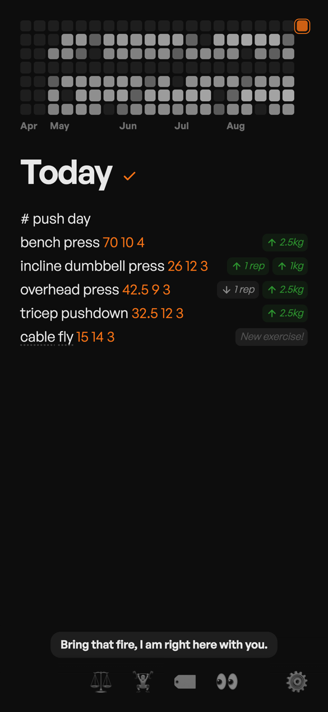
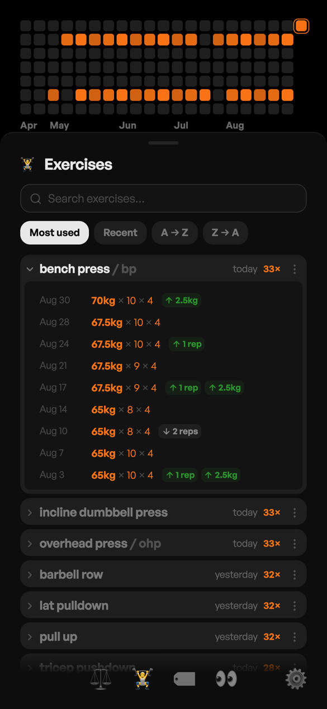
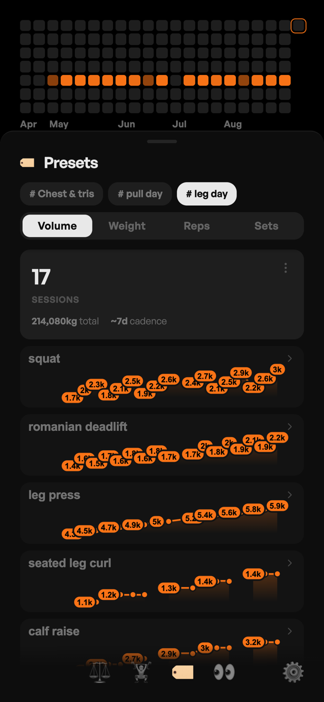
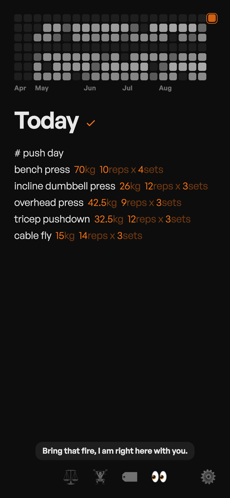
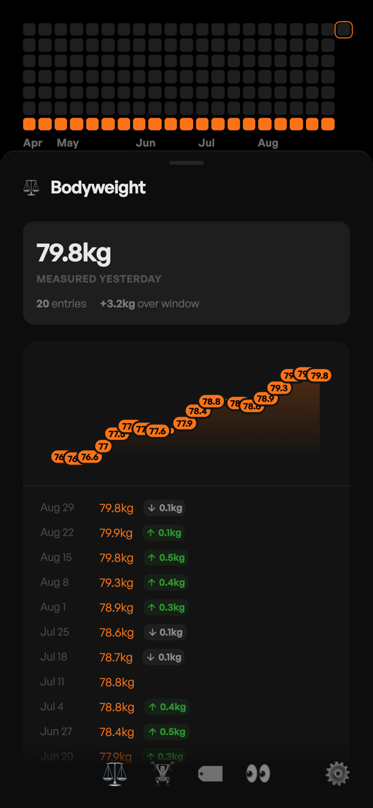
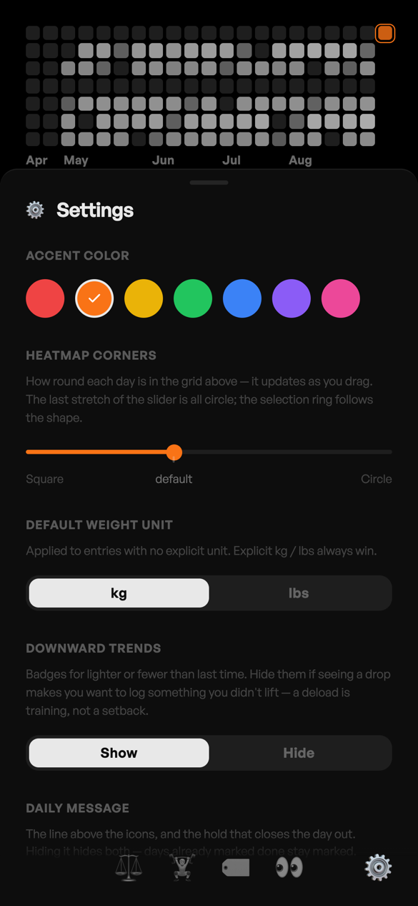
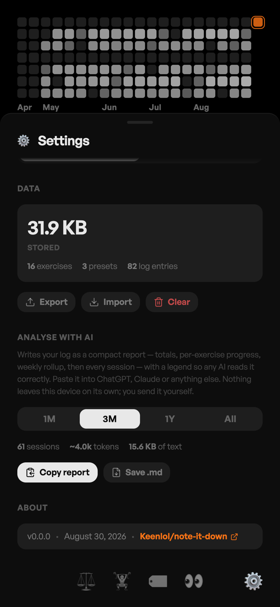

# note-it-down

A workout tracker that behaves like a notes app. No forms, no pickers, no "add
set" buttons — you type a line, and the app reads it.

```
# push day
bench press 70 10 4
incline dumbbell press 26 12 3
pull up bw+8 6 3
```

Everything lives in `localStorage`. No account, no server, no sync.

<p align="center">
  
  
  
</p>

---

## Writing a line

One exercise per line. The parser tokenizes it and works out what each number
means — there is no required order beyond the positional fallback.

```
exercise name   weight   reps   sets
```

Bare numbers fill those three slots **left to right**, so `bench press 70 10 4`
is 70 kg for 10 reps across 4 sets.

### Numbers

| You type | It reads as |
|----------|-------------|
| `70` | 70 in your default unit (Settings → kg or lbs) |
| `70kg` · `154lbs` · `154 pounds` | an explicit unit — always wins over the default |
| `10r` · `10 reps` | 10 reps, regardless of position |
| `4s` · `4 sets` | 4 sets, regardless of position |
| `4x10` | 4 sets × 10 reps — the smaller number is sets |
| `10x4reps` · `4x10sets` | the suffix decides, when the guess would be wrong |

Labelled tokens are matched first, then whatever is left over is filled
positionally. A line with fewer than two usable numbers is not an exercise —
it just sits there as text.

### Bodyweight

| You type | It reads as |
|----------|-------------|
| `pushup 3 20` | two bare numbers, no weight → bodyweight, 20 reps × 3 sets |
| `pull up bw 8 3` | your bodyweight for that date |
| `dip bw+8 8 3` · `bw-3` | bodyweight ± added load |
| `pistol squat bw*1.5 6 3` · `0.5×bw` | a multiple of bodyweight |
| `bw 79.8` (alone on a line) | logs **your** bodyweight for that day |

A `bw 79.8` line is not an exercise — it writes into the bodyweight history and
is what every `bw` exercise on that date resolves against. Days before your
first measurement fall back to it; with nothing recorded at all, 60 kg is
assumed.

Because bodyweight is resolved per date, a `bw` set logged in April is scored
against April's bodyweight, not today's.

### Sessions

A line starting with `#` is a **preset** — a session label.

```
# push day
```

It groups the exercises under it, and it is what the preset panel, the
autocomplete and the per-session stats key off. `#home`, `# home` and `# Home`
are all the same preset.

---

## What the app does with it

### Autocomplete

As you type, the app looks for the past day that best matches what is already
on today's note — scored by how many exercise names overlap — and ghosts in the
next line from it. **Tab** or **Enter** accepts.

Type `#` on its own and it lists every preset you have used, with its exercise
count. Narrow it down and, once exactly one preset matches, Enter drops the
whole session in at once.

### Trends

Each line is compared against the last time you did that exercise, and shows
what changed: weight, reps, sets, as separate badges. For bodyweight moves the
comparison is on *added* load, so `bw` → `bw` stays flat while `bw` → `bw+6`
reads as +6 kg. Downward badges can be turned off in Settings.

A name the app has never seen before gets a `New exercise!` tag.

### Heatmap

21 weeks across the top, one cell per day, shaded by that day's volume
(Σ reps × sets). Tap a cell to open that day; the note becomes editable in
place. Drag **down** anywhere to fan out older 21-week windows, drag up to put
them away. Swipe left/right on the note to step a day at a time, or use the
arrow keys.

The grid tints to your accent colour when a single exercise or preset is in
focus, so you can see exactly which days it appears on.

### Reveal

Hold 👀 to redraw the note as readable values — units and separators fade in
around the numbers you typed:

```
bench press  70kg  10reps x 4sets
```

The same note, held and released. Numbers stay full accent; the labels around
them sit back so your eye still lands on the values.

<p align="center">
  
  
</p>

### Exercises 🏋️


Every name you have ever written, searchable, sorted by use / recency / A–Z.
Expand one for its full log — date, weight × reps × sets, and the change
against the entry below it. Tap any row to jump the editor to that day.

Per exercise you can:

- **add a nickname** — `bp` shows next to `bench press`, and typing either one
  is treated as the same exercise
- **merge** — pick a target, select the strays, and `bench`, `bench press` and
  `Bench Press` collapse into one history
- **delete** — removes the exercise from every day it appears on

<br clear="right" />

### Presets 🏷️

Pick a session label and get its whole picture: how many times you have run it,
total load, how often you come back to it, then a graph per exercise —
volume, weight, reps or sets, your choice. Expand any exercise for the same
history list as the catalog, filtered to that preset.

Presets can be renamed (a display nickname; the notes are untouched), have the
label stripped from every day, or be deleted along with the exercises under it.

### Bodyweight ⚖️



Latest measurement, how many entries you have, and the drift across the current
window, over a graph of the whole history. Entries come from `bw` lines in your
notes — there is no separate form to fill in.

<br clear="right" />

### Daily message

A line above the icon row that changes each day you open the app — one pool
before you train, another after. Hold it for 700 ms to close the day out; the
message flips, confetti fires, and it resets itself at midnight. Holding again
undoes it.

It deliberately does *not* flip just because exercises are on the note: dropping
a preset in says the session was planned, not that it was trained.

---

## Settings ⚙️

<p align="center">
  
  
</p>

- **Accent colour** — seven options; recolours numbers, badges and the heatmap
- **Heatmap corners** — square through circle, applied live as you drag
- **Default weight unit** — kg or lbs, for numbers you write without a unit
- **Downward trends** — show or hide the ↓ badges
- **Daily message** — on or off
- **Data** — how much is stored, and Export / Import / Clear
- **Analyse with AI** — see below

### Your data

Export writes a single JSON file with every day, your bodyweight history,
nicknames and merges. Import takes it back, either merged into what is already
there or replacing it outright. Both are the whole store — this is the backup,
and it is the only copy that exists off the device.

**Analyse with AI** is a different thing: it renders the log as a compact
Markdown report — totals, per-exercise progress, a weekly rollup, then every
session, with a legend so the syntax needs no explanation — over 1 month, 3
months, 1 year or all time. It tells you the token count up front, then copies
it or saves a `.md`. Nothing is sent anywhere; you paste it wherever you like.

---

## Offline

Installable as a PWA. The service worker is generated at build time against the
real content-hashed filenames, so the app, its icons and its typeface are all
precached — it opens with no network at all. The font is self-hosted for the
same reason.

## Tech

- **React 19** + **TypeScript** + **Vite 8**, no backend
- A hand-written tokenizer/parser (`src/utils/parser.ts`) that everything else
  derives from
- Transparent textarea over a styled overlay for the syntax highlighting
- General Sans, self-hosted as a single 38 KB variable font
- `localStorage` for everything

## Dev

```bash
npm install
npm run dev       # Vite dev server
npm run build     # tsc + vite build → dist/
npm run preview   # serve the production build
```

No test suite — features are verified in the browser.

Design conventions (colour tokens, spacing, sheet behaviour, component
patterns) are documented in [CLAUDE.md](CLAUDE.md).

---

*Design by Keen :P, code by Claude*
